UML Diagram for Swift Design Pattern Examples
===

This project lists UML diagrams of the "[Design Pattern Examples in Swift](https://github.com/takaakit/design-pattern-examples-in-swift)". When you click on a diagram image, the diagram will be opened in **Diagram Map**. If you want to know about Diagram Map, see [this post](https://dev.to/takaakit/diagram-map-tracing-uml-sysml-elements-across-diagrams-49i7).

Behavioral Patterns
---
|  |  |  |
| :---: | :---: | :---: |
| **Chain of Responsibility** | **Command** | **Interpreter** |
| <a href="https://takaakit.github.io/uml-diagram-for-swift-design-pattern-examples/BehavioralPatterns/ChainOfResponsibility/diagram_map.html">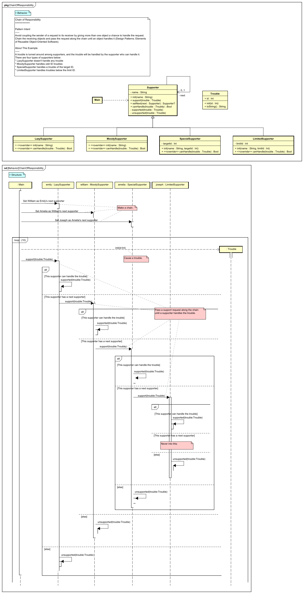</a> <a href="https://github.com/takaakit/design-pattern-examples-in-swift/tree/master/BehavioralPatterns/ChainOfResponsibility">Swift Code</a> <a href="./BehavioralPatterns/ChainOfResponsibility/execution_result.png">Execution Result</a> | <a href="https://takaakit.github.io/uml-diagram-for-swift-design-pattern-examples/BehavioralPatterns/Command/diagram_map.html">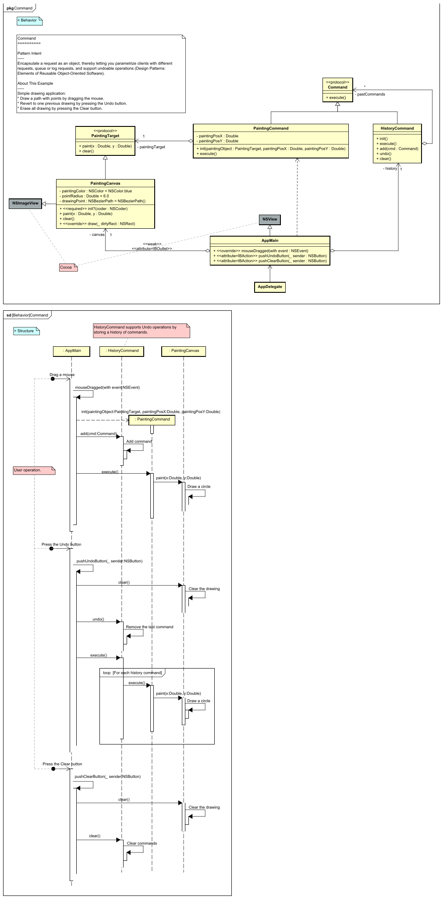</a> <a href="https://github.com/takaakit/design-pattern-examples-in-swift/tree/master/BehavioralPatterns/Command">Swift Code</a> <a href="./BehavioralPatterns/Command/execution_result.png">Execution Result</a> | <a href="https://takaakit.github.io/uml-diagram-for-swift-design-pattern-examples/BehavioralPatterns/Interpreter/diagram_map.html">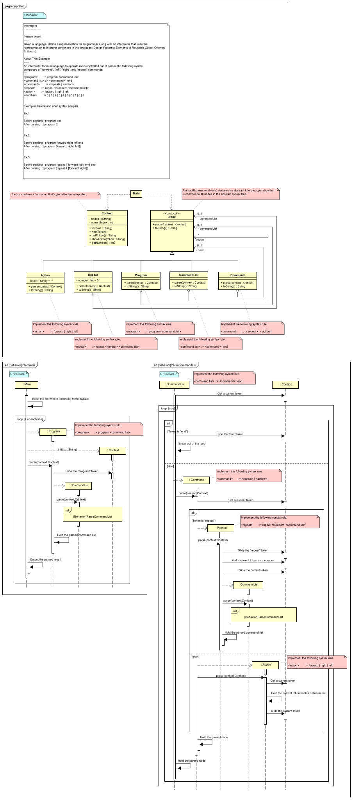</a> <a href="https://github.com/takaakit/design-pattern-examples-in-swift/tree/master/BehavioralPatterns/Interpreter">Swift Code</a> <a href="./BehavioralPatterns/Interpreter/execution_result.png">Execution Result</a> |
| **Iterator** | **Mediator** | **Memento** |
| <a href="https://takaakit.github.io/uml-diagram-for-swift-design-pattern-examples/BehavioralPatterns/Iterator/diagram_map.html">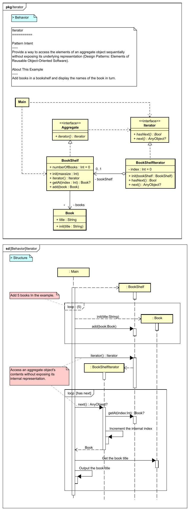</a> <a href="https://github.com/takaakit/design-pattern-examples-in-swift/tree/master/BehavioralPatterns/Iterator">Swift Code</a> <a href="./BehavioralPatterns/Iterator/execution_result.png">Execution Result</a> | <a href="https://takaakit.github.io/uml-diagram-for-swift-design-pattern-examples/BehavioralPatterns/Mediator/diagram_map.html">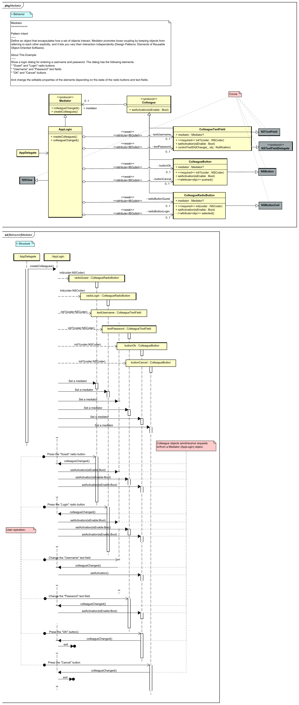</a> <a href="https://github.com/takaakit/design-pattern-examples-in-swift/tree/master/BehavioralPatterns/Mediator">Swift Code</a> <a href="./BehavioralPatterns/Mediator/execution_result.png">Execution Result</a> | <a href="https://takaakit.github.io/uml-diagram-for-swift-design-pattern-examples/BehavioralPatterns/Memento/diagram_map.html">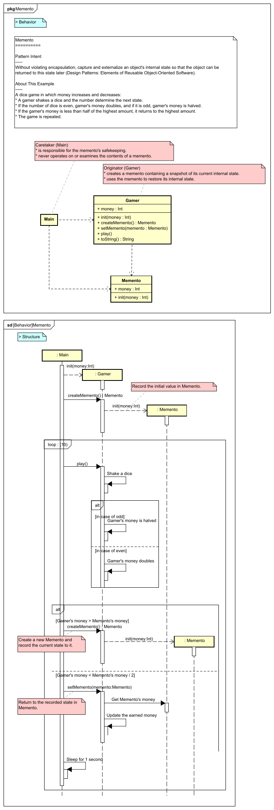</a> <a href="https://github.com/takaakit/design-pattern-examples-in-swift/tree/master/BehavioralPatterns/Memento">Swift Code</a> <a href="./BehavioralPatterns/Memento/execution_result.png">Execution Result</a> |
| **Observer** | **State** | **Strategy** |
|  <a href="https://github.com/takaakit/design-pattern-examples-in-swift/tree/master/BehavioralPatterns/Observer">Swift Code</a> <a href="./BehavioralPatterns/Observer/execution_result.png">Execution Result</a> | <a href="https://takaakit.github.io/uml-diagram-for-swift-design-pattern-examples/BehavioralPatterns/State/diagram_map.html">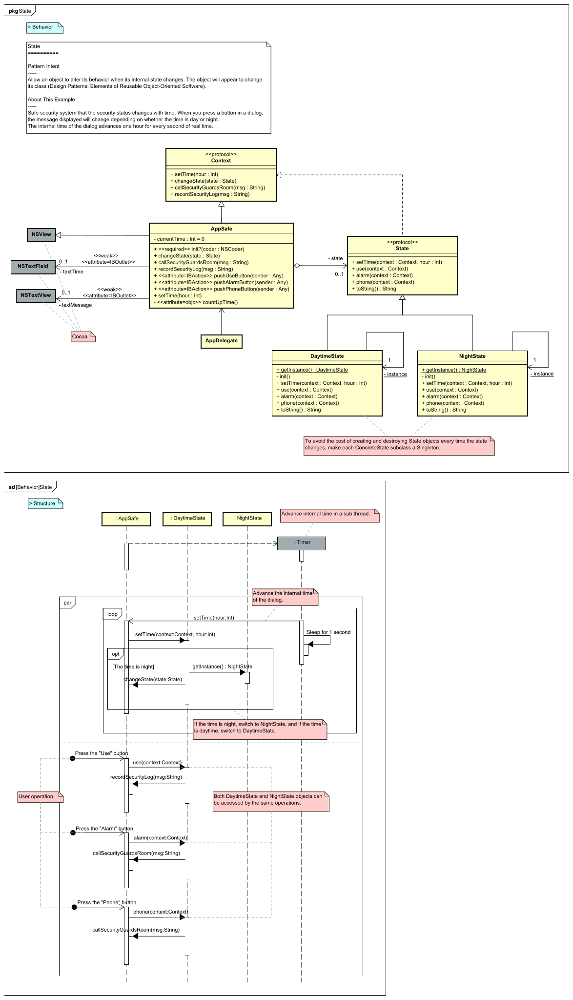</a> <a href="https://github.com/takaakit/design-pattern-examples-in-swift/tree/master/BehavioralPatterns/State">Swift Code</a> <a href="./BehavioralPatterns/State/execution_result.png">Execution Result</a> | <a href="https://takaakit.github.io/uml-diagram-for-swift-design-pattern-examples/BehavioralPatterns/Strategy/diagram_map.html">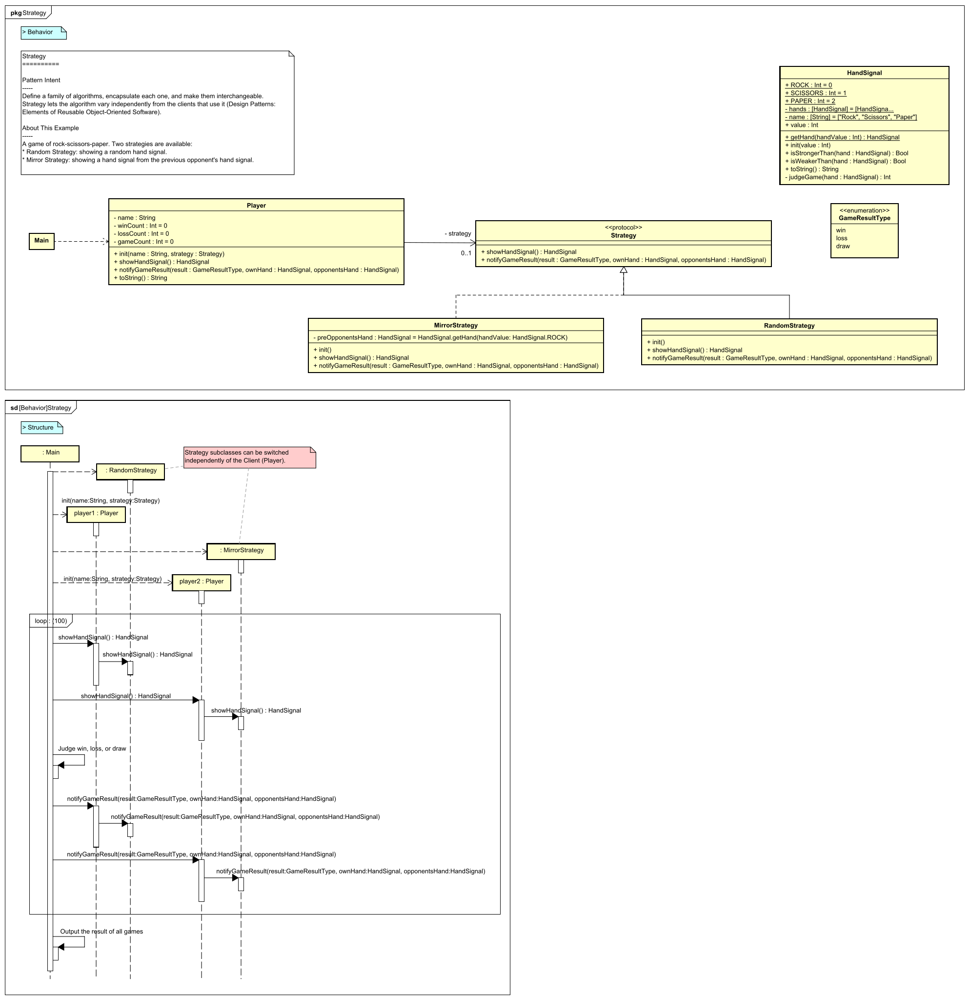</a> <a href="https://github.com/takaakit/design-pattern-examples-in-swift/tree/master/BehavioralPatterns/Strategy">Swift Code</a> <a href="./BehavioralPatterns/Strategy/execution_result.png">Execution Result</a> |
| **Template Method** | **Visitor** |  |
| <a href="https://takaakit.github.io/uml-diagram-for-swift-design-pattern-examples/BehavioralPatterns/TemplateMethod/diagram_map.html">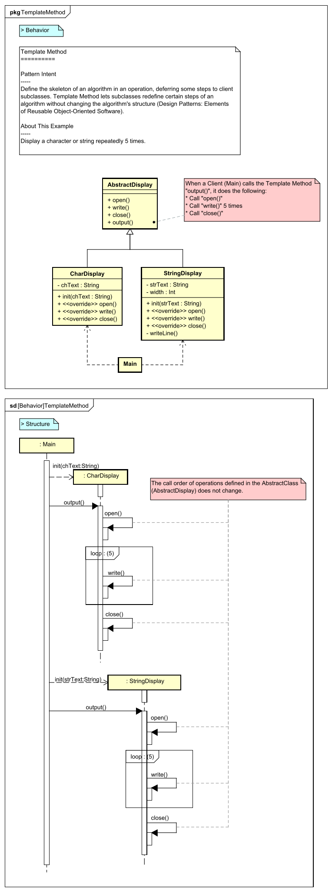</a> <a href="https://github.com/takaakit/design-pattern-examples-in-swift/tree/master/BehavioralPatterns/TemplateMethod">Swift Code</a> <a href="./BehavioralPatterns/TemplateMethod/execution_result.png">Execution Result</a> | <a href="https://takaakit.github.io/uml-diagram-for-swift-design-pattern-examples/BehavioralPatterns/Visitor/diagram_map.html">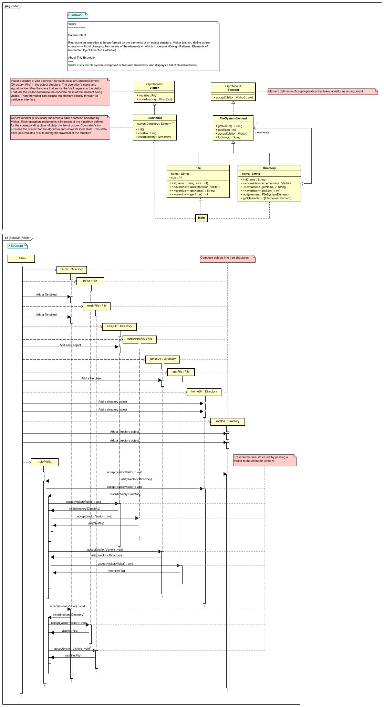</a> <a href="https://github.com/takaakit/design-pattern-examples-in-swift/tree/master/BehavioralPatterns/Visitor">Swift Code</a> <a href="./BehavioralPatterns/Visitor/execution_result.png">Execution Result</a> |  |

Creational Patterns
---
|  |  |  |
| :---: | :---: | :---: |
| **Abstract Factory** | **Builder** | **Factory Method** |
| <a href="https://takaakit.github.io/uml-diagram-for-swift-design-pattern-examples/CreationalPatterns/AbstractFactory/diagram_map.html">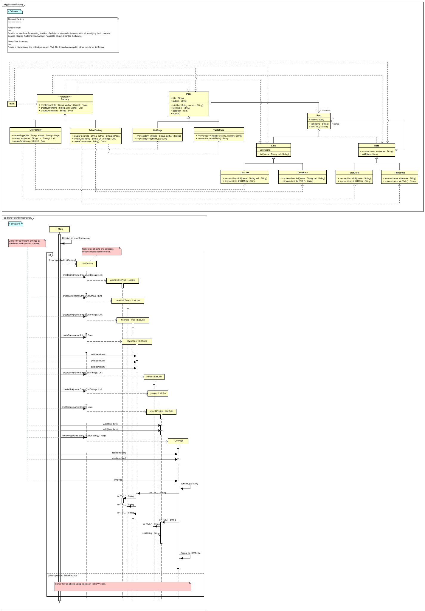</a> <a href="https://github.com/takaakit/design-pattern-examples-in-swift/tree/master/CreationalPatterns/AbstractFactory">Swift Code</a> <a href="./CreationalPatterns/AbstractFactory/execution_result.png">Execution Result</a> | <a href="https://takaakit.github.io/uml-diagram-for-swift-design-pattern-examples/CreationalPatterns/Builder/diagram_map.html">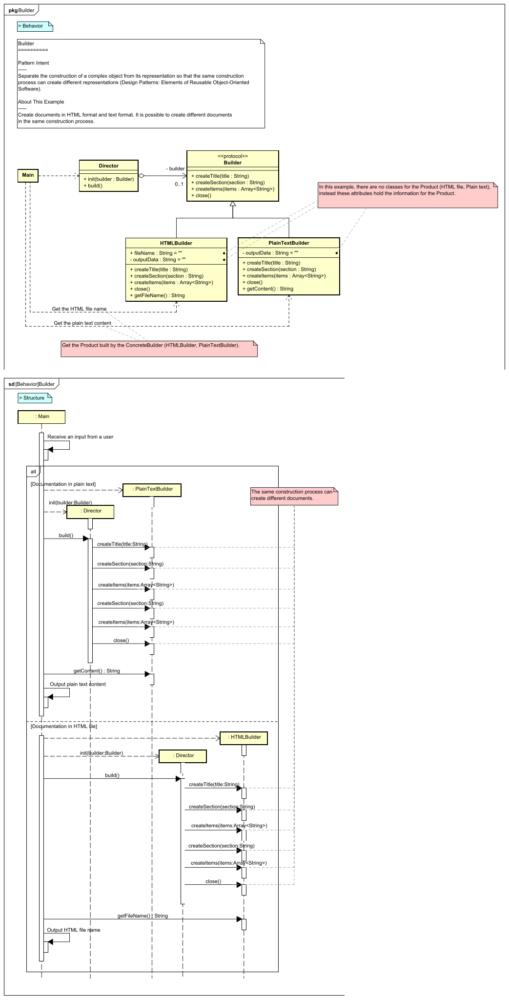</a> <a href="https://github.com/takaakit/design-pattern-examples-in-swift/tree/master/CreationalPatterns/Builder">Swift Code</a> <a href="./CreationalPatterns/Builder/execution_result.png">Execution Result</a> |  <a href="https://github.com/takaakit/design-pattern-examples-in-swift/tree/master/CreationalPatterns/FactoryMethod">Swift Code</a> <a href="./CreationalPatterns/FactoryMethod/execution_result.png">Execution Result</a> |
| **Prototype** | **Singleton** |  |
| <a href="https://takaakit.github.io/uml-diagram-for-swift-design-pattern-examples/CreationalPatterns/Prototype/diagram_map.html">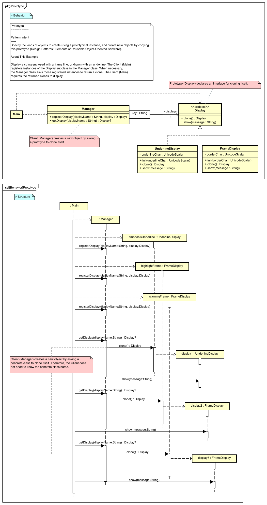</a> <a href="https://github.com/takaakit/design-pattern-examples-in-swift/tree/master/CreationalPatterns/Prototype">Swift Code</a> <a href="./CreationalPatterns/Prototype/execution_result.png">Execution Result</a> | <a href="https://takaakit.github.io/uml-diagram-for-swift-design-pattern-examples/CreationalPatterns/Singleton/diagram_map.html">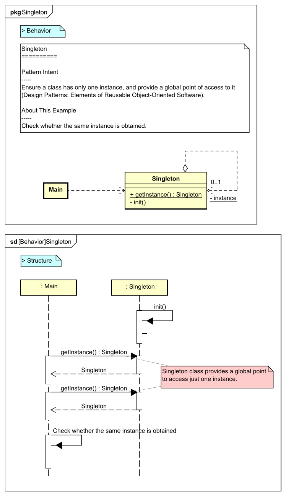</a> <a href="https://github.com/takaakit/design-pattern-examples-in-swift/tree/master/CreationalPatterns/Singleton">Swift Code</a> <a href="./CreationalPatterns/Singleton/execution_result.png">Execution Result</a> |  |

Structural Patterns
---
|  |  |  |
| :---: | :---: | :---: |
| **Adapter** | **Bridge** | **Composite** |
|  <a href="https://github.com/takaakit/design-pattern-examples-in-swift/tree/master/StructuralPatterns/Adapter">Swift Code</a> <a href="./StructuralPatterns/Adapter/execution_result.png">Execution Result</a> | <a href="https://takaakit.github.io/uml-diagram-for-swift-design-pattern-examples/StructuralPatterns/Bridge/diagram_map.html">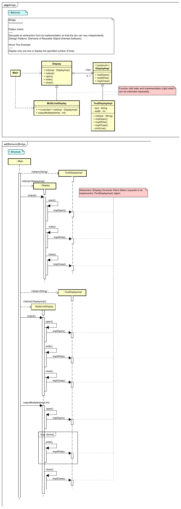</a> <a href="https://github.com/takaakit/design-pattern-examples-in-swift/tree/master/StructuralPatterns/Bridge">Swift Code</a> <a href="./StructuralPatterns/Bridge/execution_result.png">Execution Result</a> |  <a href="https://github.com/takaakit/design-pattern-examples-in-swift/tree/master/StructuralPatterns/Composite">Swift Code</a> <a href="./StructuralPatterns/Composite/execution_result.png">Execution Result</a> |
| **Decorator** | **Facade** | **Flyweight** |
| <a href="https://takaakit.github.io/uml-diagram-for-swift-design-pattern-examples/StructuralPatterns/Decorator/diagram_map.html">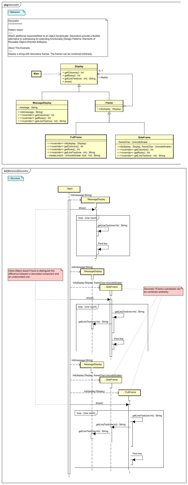</a> <a href="https://github.com/takaakit/design-pattern-examples-in-swift/tree/master/StructuralPatterns/Decorator">Swift Code</a> <a href="./StructuralPatterns/Decorator/execution_result.png">Execution Result</a> | <a href="https://takaakit.github.io/uml-diagram-for-swift-design-pattern-examples/StructuralPatterns/Facade/diagram_map.html">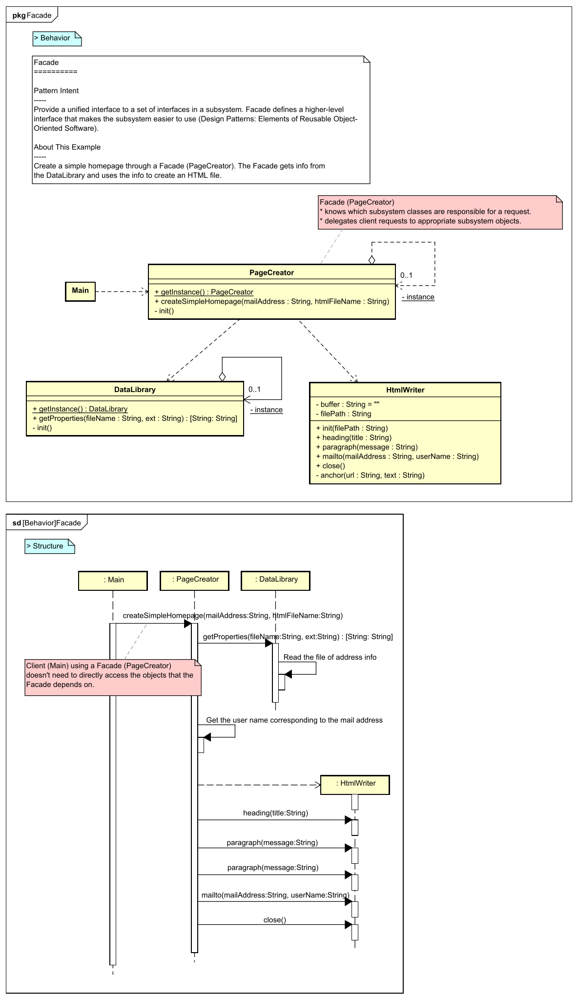</a> <a href="https://github.com/takaakit/design-pattern-examples-in-swift/tree/master/StructuralPatterns/Facade">Swift Code</a> <a href="./StructuralPatterns/Facade/execution_result.png">Execution Result</a> |  <a href="https://github.com/takaakit/design-pattern-examples-in-swift/tree/master/StructuralPatterns/Flyweight">Swift Code</a> <a href="./StructuralPatterns/Flyweight/execution_result.png">Execution Result</a> |
| **Proxy** |  |  |
|  <a href="https://github.com/takaakit/design-pattern-examples-in-swift/tree/master/StructuralPatterns/Proxy">Swift Code</a> <a href="./StructuralPatterns/Proxy/execution_result.png">Execution Result</a> | | |

References
---
* Gamma, E. et al. Design Patterns: Elements of Reusable Object-Oriented Software, Addison-Wesley, 1994
* Hiroshi Yuki. Learning Design Patterns in Java [In Japanese Language], Softbank publishing, 2004

Links
---
* [Design Pattern Examples in Swift](https://github.com/takaakit/design-pattern-examples-in-swift)
* [Diagram Map: tracing UML elements across diagrams](https://dev.to/takaakit/diagram-map-tracing-uml-sysml-elements-across-diagrams-49i7)

License
---
Diagram Map file (diagram_map.html) includes the following libraries:
* [D3.js](https://d3js.org) is copyrighted by Mike Bostock and is released under the [BSD license](https://opensource.org/licenses/BSD-3-Clause).
* [Popper.js](https://popper.js.org) is copyrighted by Federico Zivolo and is released under the [MIT license](https://opensource.org/licenses/MIT).
* [Tippy.js](https://atomiks.github.io/tippyjs) is copyrighted by atomiks and is released under the [MIT license](https://opensource.org/licenses/MIT).
* [Chroma.js](https://gka.github.io/chroma.js) is copyrighted by Gregor Aisch and is released under the [BSD license](https://opensource.org/licenses/BSD-3-Clause).

Files and data in this project other than the above libraries are under the [Creative Commons Zero (CC0) license](https://creativecommons.org/publicdomain/zero/1.0/).

Other Language Examples
-----------------------
[C++](https://github.com/takaakit/uml-diagram-for-cpp-design-pattern-examples), [C#](https://github.com/takaakit/uml-diagram-for-csharp-design-pattern-examples), [Crystal](https://github.com/takaakit/uml-diagram-for-crystal-design-pattern-examples), [Go](https://github.com/takaakit/uml-diagram-for-golang-design-pattern-examples), [Java](https://github.com/takaakit/uml-diagram-for-java-design-pattern-examples), [JavaScript](https://github.com/takaakit/uml-diagram-for-javascript-design-pattern-examples), [Kotlin](https://github.com/takaakit/uml-diagram-for-kotlin-design-pattern-examples), [Python](https://github.com/takaakit/uml-diagram-for-python-design-pattern-examples), [Ruby](https://github.com/takaakit/uml-diagram-for-ruby-design-pattern-examples), [Scala](https://github.com/takaakit/uml-diagram-for-scala-design-pattern-examples), [TypeScript](https://github.com/takaakit/uml-diagram-for-typescript-design-pattern-examples)
